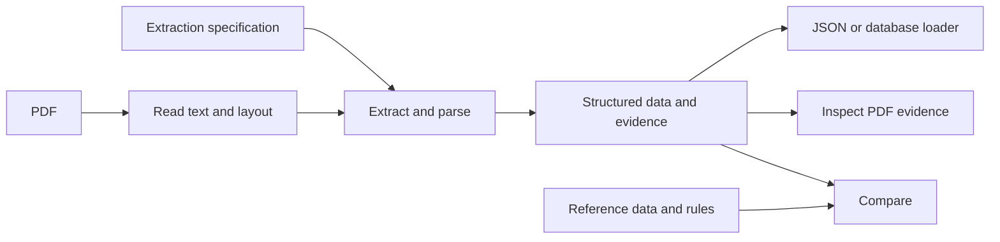

# How Janus works

## Extraction

`janus.extraction.extract(document, specification)` returns nested data and field results.
The reader recovers PDF text and tables. Scalar locators reuse the existing extraction
algorithms through a plan containing only extraction fields. Object fields preserve nesting;
record fields associate cells by their physical table row and select columns by header alias.
Typed parsing belongs to extraction. Numeric separator conventions are explicit, and decimals
remain exact strings in JSON. Missing, ambiguous, and invalid values retain an issue and source
location when available.

Field paths are JSON Pointers into the output. They remain the same when a locator changes.
Record paths use array indexes in document order; they do not establish identity across runs.
The result also carries the specification hash and document hash. The library writes no files
and needs no reference data, review metadata, or running server.

`janus.extraction.compare(result, reference, rules)` checks saved output against independent
reference data. It neither reads the PDF nor changes the extraction. Each rule explicitly pairs
an output pointer with a reference pointer. The CLI exposes both operations.

## Workbench

The home page accepts a PDF and an extraction specification. The server runs the extraction in
a worker thread and returns the completed result. It writes the document, specification, and
result in a temporary directory, then renames the directory to publish a complete run under
`JANUS_DATA_DIR/extractions`. Failed runs do not appear in history. An interrupted run is not
resumed; leftover temporary directories are hidden from history. The response waits for the
operation to finish. The browser does not create a second progress state.

The workbench puts data beside the PDF. Selecting a field shows its page and overlays its source
rectangle when available. Extraction and page previews use unrotated PDF coordinates; the
original PDF stays unchanged. Pages are rendered on demand from the saved PDF, with a maximum long
edge of 1800 pixels. Text values remain available beside the image. On narrow screens the source
pane follows the data pane. Editing a specification creates a new run and preserves the old one.
Comparison previews stay in the browser tab and can be exported; they do not alter saved data.

## Existing comparison reviews

The three-input comparison workflow remains at `/compare`. It compiles reference pointers,
reads evidence, extracts fields, and compares them. Extraction does not consult expected values.
Reviews move through `created`, `validating_inputs`, `reading_document`, `extracting_fields`,
`comparing`, and `ready`, or end in `error`. The browser reads that state from review metadata.
Versioned plan, evidence, extraction, and result artifacts remain compatible with saved reviews.

Evidence is cached by document hash; extraction is cached by document and extraction hashes.
Changing only reference data reuses both caches. The legacy comparison specification hash is
part of field identity, so changing that specification invalidates extraction reuse. Reviewer
corrections change the review's extraction and result while leaving the shared cache intact.

`not_compared` means Janus could not compare a field. `ambiguous` means it could not select one
extraction. Neither establishes that the PDF disagrees with the reference. A reviewer records
decisions in the resolution menu and can export a review as CSV or JSON.

## Cache compatibility

Bump `MACHINE_CACHE_REVISION` in `artifact_store.py` when legacy reader or extractor behavior
changes, including dependency or configuration changes that affect output. One revision covers
both stages because extraction depends on evidence. Changes only to comparison rules need no bump.
New revisions ignore old shared caches without deleting them. Saved artifacts and reviewer
decisions remain readable. Standalone extraction currently reads each document afresh.
