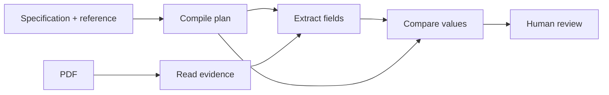

# How Janus works

The [pipeline](apps/server/src/janus/pipeline/review_pipeline.py) compiles reference pointers,
reads PDF text and tables, locates the requested values, then compares them. Extraction uses
the specification and document evidence; it does not read expected reference values.

Reviews move through `created`, `validating_inputs`, `reading_document`, `extracting_fields`,
`comparing`, and `ready`, or end in `error`. The pipeline saves versioned plan, evidence,
extraction, and result artifacts.
The browser polls review metadata and displays the current stage.
Writes use a temporary file followed by an atomic rename. Evidence is cached by document hash;
extraction is cached by document and extraction hashes. Both caches live under a shared machine
cache revision, independent of the artifact schema version. Changing only reference data reuses
both caches. Any specification change changes field IDs and invalidates extraction reuse.
Reviewer corrections change the review's extraction and result, leaving the shared cache intact.

The review screen puts fields on the left and the PDF on the right. Selecting a row opens its
PDF page and shows confidence, comparison explanation, extraction status, and row/column context.
Enter or Space selects a focused row. Each row has a resolution menu; the toolbar filters by
status and exports CSV or JSON. Status labels accompany colors. The initial theme uses the
system preference, and the header toggle saves the chosen theme.

`not_compared` means Janus could not compare the field; `ambiguous` means it could not choose
one extraction. Neither status means that the document disagrees with the reference.
A `mismatch` requires reviewer attention, including when a generated row is missing on either side.

## Cache compatibility

Bump `MACHINE_CACHE_REVISION` in `artifact_store.py` when reader or extractor behavior changes,
including dependency or configuration changes that affect their output. One revision covers both
stages because extraction depends on evidence. Changes only to comparison rules do not need a bump.

A new revision ignores old shared caches, including the earlier unversioned cache directories.
Saved review artifacts and reviewer decisions remain readable. Old cache files stay on disk;
revision changes do not delete them.
